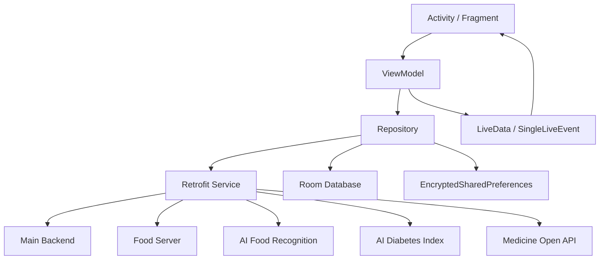
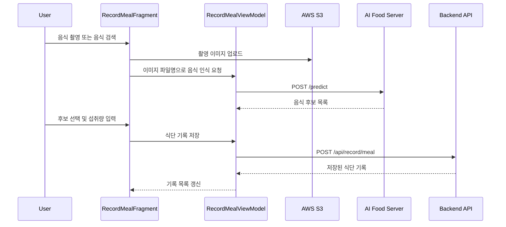

# Probodia Android

> 당뇨 관리는 꾸준하게, 식단 판단은 더 쉽게
>
> 혈당, 혈압, 식단, 복약 기록과 음식별 당뇨 지수 분석을 제공하는 당뇨 관리 Android 앱

Probodia Android는 당뇨 관리가 필요한 사용자가 매일의 건강 기록을 남기고, 섭취하려는 음식이 혈당 관리에 어떤 영향을 줄 수 있는지 확인할 수 있도록 만든 Android 애플리케이션입니다. 혈당, 혈압, 식단, 복약 기록을 한 흐름에서 관리하고, 음식 검색/이미지 인식 결과를 영양 정보와 당뇨 지수 분석으로 연결했습니다.

이 저장소는 소프트웨어 마에스트로 13기 Probodia 팀 프로젝트에서 제가 담당한 Android 클라이언트입니다. 전체 프로젝트는 2022년 4월부터 11월까지 진행했고, Android 앱 구현은 2022년 8월부터 본격적으로 진행했습니다. 12월에는 배포 버전 정리와 실행 오류 수정 같은 마무리 작업을 진행했습니다.

## Portfolio Summary

| 항목 | 내용 |
| --- | --- |
| 문제 | 당뇨 관리 사용자가 혈당, 식단, 복약 정보를 꾸준히 기록하기 어렵고, 음식 선택이 혈당 관리에 어떤 영향을 주는지 즉시 판단하기 어려운 문제 |
| 해결 | 건강 기록, 음식 검색/이미지 인식, 영양 정보, 당뇨 지수, 기록 분석, 챌린지를 하나의 Android 앱 흐름으로 연결 |
| 내 역할 | Android 클라이언트 구현, 화면/상태 흐름 설계, Retrofit API 연동, 로컬 저장소, 기록/분석/식단/챌린지 기능, 배포 안정화 |
| 대표 결과 | SW마에스트로 13기 팀 프로젝트, Android 배포 버전 `1.3.1`까지 개발. Play Store 다운로드/순위 지표는 자료 정리 후 추가 예정 |
| 기술 포인트 | Kotlin, Android ViewModel, LiveData, Coroutine, DataBinding, Retrofit, Room, EncryptedSharedPreferences, S3, MPAndroidChart, Firebase Crashlytics |

## Project Info

| 항목 | 내용 |
| --- | --- |
| 프로젝트 | Probodia |
| 과정 | 소프트웨어 마에스트로 13기 |
| 플랫폼 | Android |
| 프로젝트 기간 | 2022.04 - 2022.11 |
| Android 작업 기간 | 2022.08 - 2022.11 기능 개발, 2022.12 마무리 수정 |
| 담당 범위 | 기획 참여, Android 클라이언트 구현, 화면 흐름, API 연동, 로컬 저장소, 기록/분석/식단/챌린지 기능 |
| 앱 버전 | `versionName 1.3.1`, `versionCode 24` |
| 개발 기록 | Android 주요 기능과 배포 안정화 작업을 219개 commit으로 관리 |

## Key Results

| 구분 | 결과 |
| --- | --- |
| 앱 완성 범위 | 로그인, 사용자 정보, 건강 기록, 음식 검색/이미지 인식, 당뇨 지수, 기록 분석, 챌린지까지 주요 사용자 흐름 구현 |
| 배포 버전 | Android `versionName 1.3.1`, `versionCode 24`까지 관리 |
| 서버 연동 | 메인 백엔드, 음식 서버, AI 음식 인식 서버, AI 당뇨 지수 서버, 챌린지 서버, 의약품 Open API 연동 |
| 로컬 저장소 | Room 기반 최근 음식 검색 이력 저장 |
| 운영 대응 | Firebase Crashlytics, 앱 버전 체크, 서버 연결 실패 화면, token refresh 재시도, SSL 대응 |
| 추가 예정 | Play Store 다운로드/순위, 실제 앱 화면, 데모 영상은 자료 정리 후 추가 |

## 문제 정의

당뇨 관리는 혈당 수치만 기록해서 끝나는 작업이 아닙니다. 사용자는 식사, 복약, 혈압, 혈당을 꾸준히 남겨야 하고, 기록한 데이터를 바탕으로 생활 패턴을 조정해야 합니다. 특히 음식 선택은 당뇨 관리에 직접적인 영향을 주지만, 사용자가 매번 영양 성분과 혈당 영향을 판단하기 어렵습니다.

Probodia는 이 문제를 Android 앱 안에서 다음 흐름으로 연결했습니다.

```text
카카오 로그인
  -> 사용자 정보 등록
  -> 혈당/혈압/식단/복약 기록
  -> 음식 검색 또는 음식 이미지 인식
  -> 영양 정보와 당뇨 지수 확인
  -> 기록 분석 차트 확인
  -> 챌린지 참여로 기록 습관 유지
```

## 주요 기능

### 건강 기록

- 혈당, 혈압, 식단, 복약 기록 생성
- 오늘 기록과 과거 기록 조회
- 기록 상세 조회, 수정, 삭제
- 아침, 점심, 저녁 기준 기록 분류
- 날짜와 시간 선택 UI

### 식단 판단

- 음식명 검색과 pagination
- 최근 검색 음식 20개 로컬 저장
- 음식 상세 영양 정보 조회
- 섭취량을 `인분` 또는 `g` 단위로 입력
- 음식별 당뇨 지수 조회
- 여러 음식이 포함된 식단의 전체 당뇨 지수 조회
- 음식 이미지 촬영, S3 업로드, AI 음식 인식 결과를 식단 기록으로 연결
- 유사 분류 음식 추천

### 기록 분석

- 혈당 기록 차트
- 혈압 기록 차트
- 혈당 범위 분석
- 영양소 평균 분석
- 당화혈색소 분석
- 일, 주, 월 단위 기간 선택

### 챌린지

- 챌린지 목록 조회
- 챌린지 상세 조회
- 챌린지 참여
- 참여 중인 챌린지 조회
- 챌린지 활동 기록과 달성도 조회

### 계정과 운영 안정성

- Kakao Login 기반 진입
- access token, refresh token 암호화 저장
- token 만료 시 refresh 후 API 재시도
- 앱 버전 체크와 강제 업데이트 안내
- 서버 연결 실패 화면
- Firebase Crashlytics, Analytics 연동

## 담당 구현 범위

제가 담당한 Android 구현 범위는 다음과 같습니다.

| 영역 | 구현 내용 |
| --- | --- |
| 화면 구조 | `Activity`, `Fragment`, `BottomSheetDialogFragment`, `ViewPager2`, Bottom Navigation 구성 |
| 상태 관리 | 화면별 `ViewModel`, `LiveData`, `SingleLiveEvent` 기반 UI 상태 전달 |
| API 연동 | Retrofit service/repository 분리, 백엔드/음식/AI/챌린지/의약품 API 연결 |
| 인증 처리 | Kakao Login, 자체 API token 발급, `EncryptedSharedPreferences` 저장 |
| 기록 기능 | 혈당, 혈압, 식단, 복약 CRUD와 오늘/과거 기록 조회 |
| 식단 기능 | 음식 검색, 음식 상세, 섭취량 변환, 당뇨 지수, 이미지 기반 음식 후보 |
| 로컬 저장소 | Room을 이용한 음식 검색 이력 저장 |
| 분석 화면 | MPAndroidChart 기반 혈당/혈압 차트, 기간별 분석 화면 |
| 배포 대응 | version check, Crashlytics, SSL utility, 서버 연결 실패 처리 |

## 아키텍처

Android 앱은 MVVM과 Repository 패턴을 기반으로 구성되어 있습니다. Fragment/Activity는 사용자 입력과 화면 표시를 담당하고, ViewModel은 화면 상태와 비동기 호출을 관리합니다. Repository는 Retrofit API와 로컬 저장소 접근을 감쌉니다.



### 데이터 흐름 예시: 식단 기록



## Technical Decisions

- 화면 상태는 `ViewModel`과 `LiveData`로 분리했습니다. 기록 등록, 수정, 삭제, 분석 조회처럼 비동기 API 호출이 많은 화면에서 UI는 상태를 관찰하고, 실제 요청 흐름은 ViewModel/Repository가 담당하도록 구성했습니다.
- API 경계를 기능별 Retrofit service로 나눴습니다. 메인 백엔드, 음식 서버, AI 음식 인식 서버, AI 당뇨 지수 서버, 챌린지 서버, 의약품 Open API를 분리해 각 도메인의 요청/응답 모델을 독립적으로 관리했습니다.
- 로그인 이후 발급된 access/refresh token은 `EncryptedSharedPreferences`에 저장했습니다. token 만료 시 refresh 후 기존 요청을 재시도해 사용자가 기록 중간에 흐름을 잃지 않도록 했습니다.
- 음식 검색 이력은 Room에 저장했습니다. 서버 검색 결과와 별개로 최근 선택한 음식을 로컬에 남겨 재검색 비용을 줄이고, 검색창이 비어 있을 때 사용자가 바로 이전 음식을 선택할 수 있게 했습니다.
- 이미지 기반 식단 기록은 Android에서 촬영 이미지를 S3에 업로드한 뒤, 파일명을 AI 서버로 전달해 음식 후보를 받는 방식으로 구성했습니다. 인식 결과는 다시 음식 검색 상세 화면으로 이어져 사용자가 후보와 섭취량을 확인한 뒤 기록하도록 만들었습니다.
- 기록 분석은 MPAndroidChart와 서버 통계 API를 조합했습니다. 혈당/혈압 원시 기록, 혈당 범위, 영양소 평균, 당화혈색소를 분리해 조회하고, 사용자가 기간을 바꿨을 때 최신 선택 상태와 맞는 결과만 화면에 반영하도록 처리했습니다.
- 배포 앱에서 발생할 수 있는 실패 흐름을 고려해 Crashlytics, version check, 서버 연결 실패 화면, SSL utility를 추가했습니다.

## Challenges

- 건강 기록 도메인이 혈당, 혈압, 식단, 복약으로 나뉘어 있어 화면 흐름은 비슷하지만 요청 body와 응답 모델이 달랐습니다. 공통 기록 흐름은 유지하면서도 각 도메인의 ViewModel, DTO, Adapter를 분리해 수정 범위를 좁혔습니다.
- 식단 상세 화면에서는 섭취량, 단위, 영양소, 당뇨 지수가 서로 연결됩니다. `인분`과 `g` 단위 변환, 소수점 입력 보정, 섭취량 변경 시 당뇨 지수 재조회 흐름을 한 화면에서 처리했습니다.
- 이미지 인식은 카메라 권한, 이미지 저장, S3 업로드, AI 서버 요청, 음식 후보 선택, 식단 기록 저장이 이어지는 긴 비동기 흐름입니다. 각 단계의 결과를 ViewModel과 LiveData로 분리해 화면 갱신과 서버 요청을 연결했습니다.
- access token 만료는 거의 모든 API 화면에서 발생할 수 있었습니다. 공통 `BaseViewModel.refreshApiToken`을 두고 각 요청에서 실패 시 token 갱신 후 재시도하도록 구현했습니다.
- 분석 화면은 사용자가 기간을 바꾸는 동안 이전 요청 결과가 늦게 도착할 수 있습니다. 선택된 기간과 응답 대상 기간을 비교한 뒤 현재 화면 상태와 맞는 결과만 반영하도록 구성했습니다.
- 출시 전에는 Fragment constructor 오류, Activity/Fragment `NoSuchMethodException`, 검색 API 500 오류, SSL 이슈처럼 실제 앱 실행 중 발생한 문제를 이슈별로 수정하며 안정화했습니다.

## 프로젝트 구조

```text
Probodia/
├── app/
│   ├── src/main/java/com/piri/probodia/
│   │   ├── adapter/        # RecyclerView, ViewPager adapter
│   │   ├── data/
│   │   │   ├── db/         # Room database, DAO, entity
│   │   │   └── remote/     # Retrofit service, DTO, request body
│   │   ├── repository/     # API and preference repository
│   │   ├── view/           # Activity, Fragment
│   │   ├── viewmodel/      # Screen ViewModel and factories
│   │   ├── layout/         # Custom square view classes
│   │   └── widget/         # Event, version, SSL, conversion utility
│   └── src/main/res/
│       ├── layout/         # XML screens and list items
│       ├── drawable/       # Icons, backgrounds, images
│       ├── menu/           # Bottom navigation menu
│       └── values/         # Colors, dimensions, strings, themes
├── build.gradle
└── settings.gradle
```

## 주요 코드 포인터

| 영역 | 파일 |
| --- | --- |
| 앱 빌드 설정 | [`Probodia/app/build.gradle`](Probodia/app/build.gradle) |
| Manifest와 권한 | [`Probodia/app/src/main/AndroidManifest.xml`](Probodia/app/src/main/AndroidManifest.xml) |
| 메인 탭 구조 | [`MainActivity.kt`](Probodia/app/src/main/java/com/piri/probodia/view/activity/MainActivity.kt), [`MainPagerAdapter.kt`](Probodia/app/src/main/java/com/piri/probodia/adapter/MainPagerAdapter.kt) |
| 로그인과 초기 진입 | [`IntroActivity.kt`](Probodia/app/src/main/java/com/piri/probodia/view/activity/IntroActivity.kt), [`IntroViewModel.kt`](Probodia/app/src/main/java/com/piri/probodia/viewmodel/IntroViewModel.kt) |
| 공통 token refresh | [`BaseViewModel.kt`](Probodia/app/src/main/java/com/piri/probodia/viewmodel/BaseViewModel.kt) |
| token 암호화 저장 | [`PreferenceRepository.kt`](Probodia/app/src/main/java/com/piri/probodia/repository/PreferenceRepository.kt) |
| 메인 API | [`ServerService.kt`](Probodia/app/src/main/java/com/piri/probodia/data/remote/api/ServerService.kt), [`ServerRepository.kt`](Probodia/app/src/main/java/com/piri/probodia/repository/ServerRepository.kt) |
| 음식 검색 API | [`ServerFoodService.kt`](Probodia/app/src/main/java/com/piri/probodia/data/remote/api/ServerFoodService.kt), [`SearchFoodViewModel.kt`](Probodia/app/src/main/java/com/piri/probodia/viewmodel/SearchFoodViewModel.kt) |
| 음식 검색 이력 | [`FoodDatabase.kt`](Probodia/app/src/main/java/com/piri/probodia/data/db/FoodDatabase.kt), [`FoodDao.kt`](Probodia/app/src/main/java/com/piri/probodia/data/db/dao/FoodDao.kt) |
| 식단 기록과 이미지 인식 | [`RecordMealFragment.kt`](Probodia/app/src/main/java/com/piri/probodia/view/fragment/record/RecordMealFragment.kt), [`RecordMealViewModel.kt`](Probodia/app/src/main/java/com/piri/probodia/viewmodel/RecordMealViewModel.kt) |
| 음식 상세와 당뇨 지수 | [`SearchFoodDetailFragment.kt`](Probodia/app/src/main/java/com/piri/probodia/view/fragment/record/SearchFoodDetailFragment.kt), [`AIGlucoseServerService.kt`](Probodia/app/src/main/java/com/piri/probodia/data/remote/api/AIGlucoseServerService.kt) |
| 건강 기록 분석 | [`RecordAnalysisViewModel.kt`](Probodia/app/src/main/java/com/piri/probodia/viewmodel/RecordAnalysisViewModel.kt), [`RecordAnalysisFragment.kt`](Probodia/app/src/main/java/com/piri/probodia/view/fragment/record/analysis/RecordAnalysisFragment.kt) |
| 의약품 검색 | [`OpenApiMedicineService.kt`](Probodia/app/src/main/java/com/piri/probodia/data/remote/api/OpenApiMedicineService.kt), [`SearchMedicineViewModel.kt`](Probodia/app/src/main/java/com/piri/probodia/viewmodel/SearchMedicineViewModel.kt) |
| 챌린지 | [`ServerChallengeService.kt`](Probodia/app/src/main/java/com/piri/probodia/data/remote/api/ServerChallengeService.kt), [`ChallengeViewFragment.kt`](Probodia/app/src/main/java/com/piri/probodia/view/fragment/challenge/ChallengeViewFragment.kt) |

## 기술 스택

| 구분 | 기술 |
| --- | --- |
| Language | Kotlin |
| Android | Activity, Fragment, ViewModel, LiveData, DataBinding, RecyclerView, ViewPager2 |
| Async | Kotlin Coroutine |
| Network | Retrofit, Gson Converter, Scalars Converter |
| Local Storage | Room, EncryptedSharedPreferences |
| Login | Kakao SDK |
| Image / Cloud | Camera intent, AWS Cognito, AWS S3 SDK |
| Monitoring | Firebase Crashlytics, Firebase Analytics |
| Chart | MPAndroidChart |
| UI | Material Components, ConstraintLayout |
| Build | Android Gradle Plugin 7.0.3, Kotlin Gradle Plugin 1.6.10 |

## 개발 과정

프로젝트는 2022년 4월부터 11월까지 진행했습니다. 4월부터는 문제 정의, 기능 기획, 팀 역할 분담, 전체 서비스 흐름을 정리했고, Android 앱 구현은 8월부터 본격적으로 진행했습니다. 11월까지 기록, 식단, 분석, 챌린지, 배포 대응 기능을 완성했고, 12월에는 버전 변경과 Fragment 생성자 오류 같은 마무리 수정을 진행했습니다.

| 기간 | 진행한 작업 |
| --- | --- |
| 2022.04 - 2022.07 | 문제 정의, 서비스 기획, 사용자 기록 흐름 설계, Android/Backend/AI 역할 분리 |
| 2022.08 | 프로젝트 초기화, Kakao Login, 기록 메인, 혈당/혈압/식단 기록, 음식 검색/상세, 음식 이미지 인식, Crashlytics |
| 2022.09 | 복약 기록, 기록 상세/수정/삭제, 과거 기록, 사용자 정보, token 암호화 저장, token refresh, 검색 pagination, 날짜/시간 선택 |
| 2022.10 | 기록 분석, 혈당/혈압 차트, 영양소/당화혈색소 분석, 음식 당뇨 지수, SSL 대응, 서버 연결 실패 화면 |
| 2022.11 | 챌린지 목록/상세/참여, 음식 추천, 버전 체크, 검색 이력, 전체 식단 당뇨 지수, 배포 오류 수정 |
| 2022.12 | 버전 변경, Fragment 생성자 오류 수정, 프로젝트 루트 정리 등 마무리 수정 |

개발하면서 가장 큰 축은 기록 기능, 식단/음식 검색, 분석 화면, 챌린지, 배포 안정화였습니다. 이 흐름은 현재 코드 구조의 `record`, `analysis`, `challenge`, `data/remote`, `repository` 패키지에도 그대로 남아 있습니다.

## 실행 방법

### 요구 환경

- Android Studio
- JDK 8 compatible environment
- Android SDK 31
- Android 10, API 29 이상

### 필요한 로컬 파일

이 저장소에는 API key와 Firebase 설정 파일이 포함되어 있지 않습니다. 로컬 실행 전 아래 파일을 준비해야 합니다.

- `Probodia/local.properties`
- `Probodia/app/google-services.json`

`local.properties` 예시는 다음과 같습니다.

```properties
kakao_native_app_key=
kakao_native_app_key_manifest=
server_url=
ai_server_url=
server_food_url=
ai_glucose_server_url=
server_challenge_url=
open_api_medicine_url=
open_api_medicine_key=
aws_cognito_pool_id=
```

### Build

```bash
cd Probodia
./gradlew assembleDebug
```

전체 기능을 실행하려면 별도 백엔드 서버, AI 서버, 의약품 Open API key, AWS S3/Cognito 설정이 필요합니다.

## Validation

| 구분 | 내용 |
| --- | --- |
| 기능 흐름 | 로그인, 기록 생성/수정/삭제, 음식 검색/인식, 분석, 챌린지 화면 흐름 구현 |
| 배포 안정화 | 버전 체크, 서버 연결 실패 화면, Crashlytics, SSL 대응 추가 |
| 개발 과정 | 2022.08 - 2022.11 동안 기록/식단/분석/챌린지 기능을 순차적으로 확장 |
| 자동화 테스트 | 현재 저장소에는 Android Studio 기본 테스트만 포함. 핵심 비즈니스 로직 테스트는 추가 개선 과제 |

## Limitations & Next Improvements

- 식단 섭취량 계산, `인분`/`g` 변환, 당뇨 지수 요청 body 생성 로직에는 단위 테스트를 추가할 계획입니다.
- token refresh 재시도 로직이 여러 ViewModel에 반복됩니다. OkHttp `Authenticator` 또는 Repository 공통 래퍼로 모으면 중복과 예외 처리 편차를 줄일 수 있습니다.
- 생성자 인자를 받는 Fragment가 많습니다. Android 생명주기 복원 안정성을 높이려면 `arguments`, `FragmentResult`, `SavedStateHandle` 기반으로 바꾸는 것이 좋습니다.
- Repository와 API service에 MockWebServer 기반 테스트를 추가하면 서버 오류, token 만료, 500 응답 같은 회귀를 더 쉽게 잡을 수 있습니다.
- 현재 UI는 XML/DataBinding 기반입니다. 유지보수 관점에서는 디자인 시스템 정리, 공통 컴포넌트화, 접근성 점검을 추가할 수 있습니다.

## 추가로 필요한 자료

포트폴리오 제출 전 아래 자료를 정리하면 README 상단과 결과 섹션에 반영할 수 있습니다.

| 자료 | 목적 |
| --- | --- |
| 앱 대표 스크린샷 4-6장 | 첫 화면에서 결과물의 완성도를 보여줌 |
| 핵심 플로우 GIF 또는 짧은 영상 | 기록 생성, 음식 검색/인식, 당뇨 지수, 분석 흐름을 빠르게 증명 |
| Google Play 링크 또는 Play Console 캡처 | 다운로드 수, 배포 경험, 실제 사용자 지표 정리 |
| SW마에스트로 관련 자료 | 팀 프로젝트 맥락과 프로그램 신뢰도 보강 |
| 시스템 아키텍처 이미지 | Android, backend, AI, AWS의 역할 분리 설명 |
| 본인 기여 범위 캡처 | 팀 프로젝트에서 Android 담당 범위를 명확히 증명 |
| 발표 자료 또는 데모 영상 | 프로젝트 문제 정의와 최종 결과를 빠르게 보여줌 |
